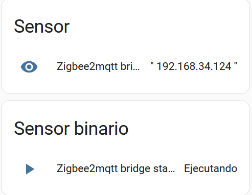

# Zigbee2mqtt High-Availability controller prototype

## Introduction

High Availability controller prototype for two zigbee2mqtt instances with independent USB Zigbee dongles (specifically implemented for Sonoff ZBDongle-P). The final purpose is enabling that one of the zigbee2mqtt instances could play the "active" role, meanwhile the second one is in "stand-by" status for a single Zigbee network (enabling also an automated switchover between active and stand-by nodes in case of detecting problems in the active instance). Please note that Zigbee standard only allows to define a single coordinator node, so the only available high-availability model that could be used is active-stand by. Detailed features:

- __Automatic synchronization of zigbe2mqtt configuration and data files__ from active to stand-by instance, to ensure an up-to-date Zigbee and MQTT interactions in case of active to stand-by switch over is triggered.
- __Automatic synchronization of Sonoff ZDongle-P coordinator's Non-Volatile RAM__, from active to stand-by instance, in each zigbee2mqtt node where the dongle is connected to. It enables a seamless change of Zigbee coordinator from active to stand-by node when required (avoiding any impact on the rest of Zigbee mesh nodes, not requiring to re-join them to the network).
- __Control point enabled in a third node__, where MQTT broker is working, to detect issues with active zigbmee2mqtt instance and trigger the switchover to change the service to use the stand-by node. The prototype includes the automated management of this control point in a Home Assistant instance with MQTT component configured.

The overall design is shown in the following diagram:

</img>

## Environment details

Find below some relevant details about the prototype environment used. In case of using a different environment, it could be required to make some minor adaptations in the scripts provided:

- __Zigbee coordinators (2x)__: Sonoff ZBDongle-P, with Z-Stack-firmware (https://github.com/Koenkk/Z-Stack-firmware/tree/master/coordinator/Z-Stack_3.x.0/). In case of using a different one, it could involve to change the commands to read and write non-volatile memory in the dongles.
- __Zigbee2mqtt nodes (2x)__: usage of up-to-date Alpine Linux distribution to execute zigbee2mqtt service (https://www.zigbee2mqtt.io/). Zigbee2mqtt application is deployed and started and stopped using Alpine service commands defined for that purpose. In case of using a different distribution, some minor changes could be required for remote start and stop of zigbee2mqtt from controlling scripts.
  - Example of Alpine service content of /etc/init.d/zigbee2mqtt to start and stop the application with rc-service command: https://github.com/chemadh/zigbee2mqtt_ha/blob/main/zigbee2mqtt_alpine_service_example . __The zigbee2mqtt service should NOT be launched on node startup, otherwise the HA control prototype will not work properly__.
  - Alpine Linux user is expected to allow sudo, to allow access to Linux service scripts to start and stop zigbee2mqtt, as well as allowing zigpy-znp to access to dongle USB port.
- __MQTT broker node__: Usage of Linux Debian distribution for High-Availability control script execution. Home assistant containing the MQTT broker component communicating with Zigbee2mqtt deployed in Docker mode in the same Linux node. No impact expected by using a different Linux distribution or directly Home Assistant OS. Some reference instructions:
  - Home Assistant supervised setup: https://community.home-assistant.io/t/installing-home-assistant-supervised-using-debian-12/200253
  - Installation of Mosquitto MQTT broker Home Assitant component:  https://www.home-assistant.io/integrations/mqtt

Common components used in the nodes previously defined:

- __Linux packages__: rsync, snmp (net-snmp-tools for Alpine; snmpd, snmp, libsnmp-dev, for Debian).
  - In addition to this, specifically for zigbee2mqtt nodes: python3, py3-pip. Installation of zigpy-znp python component (pip install zigpy-znp). Aditional info in this link: https://github.com/zigpy/zigpy-znp/blob/0cacf7a51d205ac3a19acde10a8115cf5ac36ce1/TOOLS.md
- __NTPD or Timesyncd__ time synchronization service to be active in each node to ensure a correct synchronization of most recent files. It can be skipped if the nodes are virtualized and obtaining time reference from a hypervisor cluster (like Proxmox Virtual Environment - https://pve.proxmox.com/wiki/Main_Page -). 
- __SNMP MIBs__: The scripts notify about execution results using SNMP traps. The MIBs to be included in each Linux node using the proposed scripts are stored in https://github.com/chemadh/zigbee2mqtt_ha/tree/main/MIBs . In case of no monitoring system available in your installation, the scripts can be configured to not use SNMP, so these packages and MIB installation could be skipped.
- __Enable remote ssh connection__ between components (MQTT broker and zigbee2mqtt nodes) without interactive credentials. Some example instructions here: https://www.thegeekdiary.com/how-to-run-scp-without-password-prompt-interruption-in-linux/

__Zigbee dongle configuration__:

- Zigbee IEEE address of active Zigbee coordinator (Sonoff ZBDongle-P) must be flashed as secondary IEEE address of the stand-by Zigbee coordinator. It is required to be identified as the same node by the rest of the Zigbee network when the service is switched-over between coordinators. Please note that some of the flashing tools only shows the primary IEEE address, but it doesn't mean that the secondary address is not effectively updated. Some guides below to update firmware, read and write IEEE address in Sonoff ZBDongle-P:
  - https://sonoff.tech/wp-content/uploads/2021/12/SONOFF-Zigbee-3.0-USB-dongle-plus-firmware-flashing-1-1.pdf
  - https://www.zigbee2mqtt.io/guide/adapters/flashing/copy_ieeaddr.html
  - https://github.com/JelmerT/cc2538-bsl

## Scripts for synchronization of configuration files from active to stand-by zigbee2mqtt

Each zigbee2mqtt High-Availability instance needs to synchronize the configuration files from active to stand-by instances. The following scripts to be deployed in each zigbee2mqtt instance are shared to achieve it:

- [Script for synchronization in zigbee2mqtt node 1 - /scripts/zigbee2mqtt1/syncZigbee2mqttConfig.sh](./scripts/zigbee2mqtt1/syncZigbee2mqttConfig.sh)
- [Script for synchronization in zigbee2mqtt node 2 -/scripts/zigbee2mqtt2/syncZigbee2mqttConfig.sh](./scripts/zigbee2mqtt2/syncZigbee2mqttConfig.sh)

Both files include the same logic, with different example configuration parameters to define local or remote zigbee2mqtt node variables. The first lines in each script contains the configuration variables to be updated to each environment. Explanation of each parameter, below:

- __local_aux_dir__: Path of the local zigbee2mqtt instance auxiliary directory where the up-to-date active configuration files will be stored. Example value: /home/zigbee/scripts/zigbee2mqtt_config/
- __remote_conf_dir__: SSH path (including IP and username) to the remote zigbee2mqtt instance directory where the Zigbee2mqtt application reads and updates the configuration, when it is active. Example value: zigbee@192.168.34.124:/opt/zigbee2mqtt/data/
- __local_conf_dir__: Path of the local zigbee2mqtt instance directory where the Zigbee2mqtt application reads and updates the configuration, when it is active. Example value: /opt/zigbee2mqtt/data/
- __local_user_name__: Linux username to execute rsync command. It should be enabled to execute SSH over remote zigbee2mqtt node without requiring interactive credentials. Example value: zigbee
- __snmp_server__: SNMP server where the script will send SNMP traps (v2) notifying about the result of the execution. If this functionality is not required, the value of the variable should be leaved empty. Example value: 192.168.34.103:1234
- __snmp_host__: Source SNMP host of the trap, following the MIB defined for this purpose. It can be left empty if the SNMP functionality is not required. Example value: zigbee2mqtt1
- __local_zigbee2mqtt_frontend_ip__: Zigbee2mqtt normally uses a web frontend to enable application management. Since the web frontend IP is defined in the configuration files, it is required to be updated when synchronizing the configuration files between different nodes. This parameter defines de local zigbee2mtt instance web frontend IP. Example value: 192.168.34.123
- __remote_zigbee2mqtt_frontend_ip__: The same as the parameter above, but in this case, referring to the remote zigbee2mqtt instance web frontend IP. Example value: 192.168.34.124

The scripts are intended to be run with cron or timer services (i.e. each 5 minutes), to ensure an automatic zigbmee2mqtt configuration synchronization. Example of this type of config in Alpine Linux with root user (more instructions in https://lucshelton.com/blog/cron-jobs-with-alpine-linux-and-docker/):

- include the following content in /etc/crontabs/root: */5     *       *       *       *       run-parts /etc/periodic/5min
- execute mkdir /etc/periodic/5min
- include the script content in /etc/periodic/5min/syncZigbee2mqttConfig
  - No .sh extension should be added to the service script.

## Scripts for Zigbee2mqtt High-Availability centralized control

A third node will control the active to stand-by failover action between zigbee2mqtt coordinators (whose configuration is synchronized using the scripts defined above). It makes sense that this third node should be the MQTT broker node (like Mosqitto running in Home Assistant environment), since this element will be notified in case the communication with active zigbee2mqtt fails. The following set of scripts are provided for this purpose:

### ping_mqtts.sh

Script to check connectivity from controller to both zigbee2mqtt instances. It is intended to check connectivity with both nodes before making an scheduled active to stand-by switchover. The first lines in the script contains the configuration variables to be updated for each environment. Explanation of each parameter, below:

- __zigbee2mqtt1_IP__: IP of first zigbee2mqtt instance. Example value: 192.168.34.123
- __zigbee2mqtt2_IP__: IP of second zigbee2mqtt instance. Example value: 192.168.34.124
- __snmp_server__: SNMP server where the script will send SNMP traps (v2) notifying about the result of the execution. If this functionality is not required, the value of the variable should be leaved empty. Example value: 192.168.34.103:1234
- __snmp_host__: Source SNMP host of the trap, following the MIB defined for this purpose. It can be left empty if the SNMP functionality is not required. Example value: homeassistant

The script can be directly executed from the Linux prompt. No command-line parameters are required. Resource allocation:

- [ping_mqtts.sh, using default path for known hosts and keys for passwordless SSH](./scripts/homeAssistant_supervised/ping_mqtts.sh)
- [ping_mqtts.sh, using specific path for known hosts and keys for passwordless SSH](./scripts/homeAssistant_os/ping_mqtts.sh)

### stopZigbee2mqtt1.sh / stopZigbee2mqtt2.sh

Couple of scripts to stop remotely each zigbee2mqtt instance. Used by the controller node to initiate a manual switchover between active and stand-by nodes, when MQTT can detect service interruption in the active zigbee2mqtt node. The first lines in the script contains the configuration variables to be updated for each environment. Explanation of each parameter, below:

- __zigbee2mqtt1_remote_ssh__ / __zigbee2mqtt2_remote_ssh__ (Depending on the script for each zigbee2mqtt instance): SSH user and IP to use for remote connection with the zigbee2mqtt node. The user should be previously configured to not require interactive login. Example value: "zigbee@192.168.34.123"
- __zigbee2mqtt_stop_cmd__: Remote stop command to execute in the remote SSH session to stop the zigbee2mqtt instance. In the case of using an Alpine Linux distribution for zigbee2mqtt (like in this prototype), the following can be used: "sudo rc-service zigbee2mqtt stop"
- __snmp_server__: SNMP server where the script will send SNMP traps (v2) notifying about the result of the execution. If this functionality is not required, the value of the variable should be leaved empty. Example value: 192.168.34.103:1234
- __snmp_host__: Source SNMP host of the trap, following the MIB defined for this purpose. It can be left empty if the SNMP functionality is not required. Example value: homeassistant

The script can be directly executed from the Linux prompt. No command-line parameters are required. Resource allocation:

- [stopZigbee2mqtt1.sh, using default path for known hosts and keys for passwordless SSH](./scripts/homeAssistant_supervised/stopZigbee2mqtt1.sh)
- [stopZigbee2mqtt1.sh, using specific path for known hosts and keys for passwordless SSH](./scripts/homeAssistant_os/stopZigbee2mqtt1.sh)
- [stopZigbee2mqtt2.sh, using default path for known hosts and keys for passwordless SSH](./scripts/homeAssistant_supervised/stopZigbee2mqtt2.sh)
- [stopZigbee2mqtt2.sh, using specific path for known hosts and keys for passwordless SSH](./scripts/homeAssistant_os/stopZigbee2mqtt2.sh)

### activeZigbee2mqtt1.sh / activeZigbee2mqtt2.sh

Couple of scripts to perform zigbee2mqtt switchover, changing the active service in the first or second node respectively. Sequence of activities followed by each script:

- __activeZigbee2mqtt1.sh__: it applies switchover to active the service in zigbee2mqtt first node.
  - Stop zigbee2mqtt second node, that should be in active status.
  - Stop zigbee2mqtt first node, that should be in stand-by status (to ensure it is not previously active).
  - Extract Zigbee USB dongle coordinator NVRAM memory content from zigbee2mqtt second node, copying it to zigbee2mqtt first node.
  - Load coordinator NVRAM memory content in zigbee2mqtt first node's dongle, load the synchronized zigbee2mqtt configuration files and start the first node instance.
  - Restart zigbee2mqtt second node, to leave it clean in case of scheduling a new switchover further. __Zigbee2mqtt should not start on system startup avoid interactions with this mechanism__.
- __activeZigbee2mqtt2.sh__: it applies switchover to active the service in zigbee2mqtt second node.
  - Stop zigbee2mqtt first node, that should be in active status.
  - Stop zigbee2mqtt second node, that should be in stand-by status (to ensure it is not previously active).
  - Extract Zigbee USB dongle coordinator NVRAM memory content from zigbee2mqtt first node, copying it to zigbee2mqtt second node.
  - Load coordinator NVRAM memory content in zigbee2mqtt second node's dongle, load the synchronized zigbee2mqtt configuration files and start the second node instance.
  - Restart zigbee2mqtt first node, to leave it clean in case of scheduling a new switchover further. __Zigbee2mqtt should not start on system startup avoid interactions with this mechanism__.

As described above, both scripts define a similar logic, with different details to apply the switchover to a different node. The first lines in the script contains the configuration variables to be updated for each environment. Explanation of each parameter, below:
- __zigbee2mqtt1_remote_ssh__: SSH user and IP to use for remote connection with the first zigbee2mqtt node. The user should be previously configured to disable interactive login. Example value:"zigbee@192.168.34.123"
- __zigbee2mqtt2_remote_ssh__: SSH user and IP to use for remote connection with the second zigbee2mqtt node. The user should be previously configured to disable interactive login. Example value:"zigbee@192.168.34.124"
- __zigbee2mqtt_stop_cmd__: Remote stop command to execute in the remote SSH session to stop the zigbee2mqtt instance. In the case of using an Alpine Linux distribution like in this prototype, the following can be used: "sudo rc-service zigbee2mqtt stop"
- __zigbee2mqtt_start_cmd__: Remote start service command to execute in the remote SSH session to launch zigbee2mqtt instance. In the case of using an Alpine Linux distribution like in this prototype, the following can be used: "sudo rc-service zigbee2mqtt start"
- __snmp_server__: SNMP server where the script will send SNMP traps (v2) notifying about the result of the execution. If this functionality is not required, the value of the variable should be leaved empty. Example value: 192.168.34.103:1234
- __snmp_host__: Source SNMP host of the trap, following the MIB defined for this purpose. It can be left empty if the SNMP functionality is not required. Example value: homeassistant
- __coordinator_port_zigbee2mqtt1__: USB port where Zigbee USB dongle is available in zigbee2mqtt first node. Example value: "/dev/ttyUSB0"
- __coordinator_port_zigbee2mqtt2__:  USB port where Zigbee USB dongle is available in zigbee2mqtt second node. Example value: "/dev/ttyUSB0"
- __zigbee2mqtt_nvram_path__: Directory where the remote NVRAM dump file from USB coordinator dongle will be stored. Example value: "/home/zigbee/scripts/"
- __zigbee2mqtt_nvram_file__: Name of the remote NVRAM dump json file from USB coordinator dongle. Example value: "backup_coordinator_nvram.json"
- __local_aux_dir__: Path of the remote zigbee2mqtt node directory where the up-to-date active configuration files are be stored. Example value: /home/zigbee/scripts/zigbee2mqtt_config/
- __local_conf_dir__: Path of the remote zigbee2mqtt node directory where the Zigbee2mqtt application reads and updates the configuration when it is active. Example value: /opt/zigbee2mqtt/data/

The scripts can be directly executed from the Linux prompt. No command-line parameters are required. Resource allocation:

- [activeZigbee2mqtt1.sh, using default path for known hosts and keys for passwordless SSH](./scripts/homeAssistant_supervised/activeZigbee2mqtt1.sh)
- [activeZigbee2mqtt1.sh, using specific path for known hosts and keys for passwordless SSH](./scripts/homeAssistant_os/activeZigbee2mqtt1.sh)
- [activeZigbee2mqtt2.sh, using default path for known hosts and keys for passwordless SSH](./scripts/homeAssistant_supervised/activeZigbee2mqtt2.sh)
- [activeZigbee2mqtt2.sh, using specific path for known hosts and keys for passwordless SSH](./scripts/homeAssistant_os/activeZigbee2mqtt2.sh)

## Usage of High-Availability control scripts from Home Assistant

This section assumes that the controller scripts defined previously are deployed in a Linux system where Home Assistant is also available. The two zigbee2mqtt remote nodes should be also running with automatic zigbee2mqtt config synchronization up and running in the same LAN.

In addition to this, there are some limitations related to the Home Assistant's shell script environment that needs to be addressed.

### Environment preparation for Home Assistant installed in Docker / Supervised options

Running shell scripts in Home Assistant under Docker or Supervised installation options is problematic in case of requiring additional packages, like in our case, SNMP. The reason for this is the Home Assistant upgrade process: it will not preserve the custom packages installed by the user under the Home Assistant Docker environment. In addition to this, there is a maximum time of script execution defined in Home Assistant by design: 1 minute. The proposed workaround to avoid these issues is executing the scripts remotely, connecting from Home Assistant to the host machine where the system is running (The control scripts defined above should be stored there).

To follow this approach, Home Assistant environment should enable the next points (it should be accessible from host machine executing sudo docker exec -it homeassistant bash). This parametrization is mainly needed to enable SSH connection without interactive credentials again:

- Generate the RSA public file for the Docker host machine user to connect to via SSH from Home Assistant Docker. In order to avoid accidental removal during updates, it is recommended to be stored in /config/.ssh/id_rsa.pub path of Home Assistant Docker.
- Define a custom "known hosts" file also in a path where Home Assistant Docker won't remove it. It is recommended to be stored in /config/.ssh/known_hosts.
- Creation of "sh" directory in root dir of Home Assistant Docker. Local Docker scripts will be defined there to link with the High Availability control scripts in the Docker Host machine. The scripts to be copied should be the ones available on ./scripts/homeAssistant_supervised/ project github path, since it defines the default location for known-hosts and RSA keys for passwordless SSH.

The scripts to define inside the Home Assistant Docker are defined below. The Parameters to replace directly in the contents of these scripts are:
    - < user >: User of Home Assistant host machine
    - < ip >: IP of host machine
    - < script_path >: Path directory where the controller scripts are available in the host machine
    - SNMP MIBs should be pasted to default OS directory (i.e. /usr/share/snmp/mibs/).

### Environment preparation for Home Assistant installed in Home Assistant OS option

Running shell scripts in Home Assistant OS installation option is also problematic in case of requiring additional packages, like in our case, SNMP. The reason for this is the Home Assistant upgrade process: it will not preserve the custom packages installed by the user under the Home Assistant OS environment. In addition to this, there is also the same maximum time of script execution defined in Home Assistant by design: 1 minute. The proposed workaround to avoid these issues is executing the scripts remotely, connecting from Home Assistant to the plugin "Advanced SSH & Web Terminal" (https://github.com/hassio-addons/addon-ssh/). This component allows enabling SSH access to the shell component, include specific Alpine Linux packages and execute startup scripts. 

To follow this approach, Home Assistant environment should enable the next points (it should be accessible from host machine executing sudo docker exec -it homeassistant bash). This parametrization is mainly needed to enable SSH connection without interactive credentials again:

- Installation of "Advanced SSH & Web Terminal" plugin in Home Assistant.
- Generate the RSA public file for the Docker host machine user to connect to via SSH from Home Assistant Docker. In order to avoid accidental removal during updates, it is recommended to be stored in /config/.ssh/id_rsa.pub path of Home Assistant "Advanced SSH & Web Terminal" plugin.
- Define a custom "known hosts" file also in a path where Home Assistant "Advanced SSH & Web Terminal" plugin won't remove it. It is recommended to be stored in /config/.ssh/known_hosts.
- Creation of "sh" directory in root dir of "Advanced SSH & Web Terminal" plugin. Local Home Assistant scripts will be defined there to execute remotely the High Availability control scripts via SSH in "Advanced SSH & Web Terminal". The scripts to be copied should be the ones available on ./scripts/homeAssistant_os/ project github path, since it defines the custom location for known-hosts and RSA keys for passwordless SSH.
- Creation of directory inside "Advanced SSH & Web Terminal" plugin, to store the scripts to be executed via SSH from Home Assistant. it's recommended to use "remote" subdirectory inside "sh" directory created before.
- Configuration of "Advanced SSH & Web Terminal" plugin. Enable remote SSH access using the RSA public key defined in /config/.ssh/id_rsa.pub. Include SNMP packages for Linux Alpine: net-snmp-tools. Definition of startup script to copy the SNMP MIBs to notify about scripts result, in case of storing the MIBs in plugin path /root/homeassistant/mibs/:
```
#!/bin/bash
cp /root/homeassistant/mibs/* /usr/share/snmp/mibs/
```
The scripts to define inside the Home Assistant Docker are defined below. The Parameters to replace directly in the contents of these scripts are:
    - < user >: User of Home Assistant host machine
    - < ip >: IP of host machine
    - < script_path >: Path directory where the controller scripts are available in the host machine

### ping_mqtts.sh
```
#!/bin/bash

ssh -o UserKnownHostsFile=/config/.ssh/known_hosts -i /config/.ssh/id_rsa <user>@<ip> '<script_path>/ping_mqtts.sh'
```

### stopZigbee2mqtt1.sh
```
#!/bin/bash

ssh -o UserKnownHostsFile=/config/.ssh/known_hosts -i /config/.ssh/id_rsa <user>@<ip> '<script_path>/stopZigbee2mqtt1.sh'

```

### stopZigbee2mqtt2.sh
```
#!/bin/bash

ssh -o UserKnownHostsFile=/config/.ssh/known_hosts -i /config/.ssh/id_rsa <user>@<ip> '<script_path>/stopZigbee2mqtt2.sh'

```
### activeZigbee2mqtt1.sh
This is where the maximum Home Assistant shell script execution time of 1 minute should be avoided: the full fallback procedure usually takes more than this (mainly because of time required to extract and write NVRAM dumps in Zigbee USB dongles). In consequence, the script below is defined to execute switchover operations in second plane (using nohup parameter). The results are stored in a file, just if it needs to be checked (result.log in the same script path).

```
#!/bin/bash

ssh -o UserKnownHostsFile=/config/.ssh/known_hosts -i /config/.ssh/id_rsa -f <user>@<ip> 'rm <script_path>/result.log; nohup <script_path>/activeZigbee2mqtt1.sh ><script_path>result.log 2>&1 </dev/null &'

```
### activeZigbee2mqtt2.sh
Same comment applicable from activeZigbee2mqtt1, above.
```
#!/bin/bash

ssh -o UserKnownHostsFile=/config/.ssh/known_hosts -i /config/.ssh/id_rsa -f <user>@<ip> 'rm <script_path>/result.log; nohup <script_path>/activeZigbee2mqtt2.sh ><script_path>result.log 2>&1 </dev/null &'

```

### configuration.yaml additions in Home Assistant

Once the previous steps are completed, the following content can be added to configuration.yaml of Home Assistant in order to enable zigbee2mqtt as a sensor that can be monitored. __The final purposes are__:

- Identification of the Zigbee2mqtt instance that is currently running, identified by its IP.
- Identification of the active Zigbee2mqtt instance status. It allows Home Assistant automations to trigger the active to stand-by instance failover, when a transition to stop status is detected in the active Zigbee2mqtt node.

```
mqtt:
  binary_sensor:
    - name: "Zigbee2mqtt bridge status"
      state_topic: "zigbee2mqtt/bridge/state"
      unique_id: "zigbee2mtt bridge status"
      value_template: '{{ value_json.state}}'
      payload_on: "online"
      payload_off: "offline"
      device_class: running
  sensor:
    - name: "Zigbee2mqtt bridge info"
      unique_id: "zigbee2mtt bridge info"
      state_topic: "zigbee2mqtt/bridge/info"
      value_template: >
        "
           {{ "192.168.34.123" }}
         
         
           {{ "192.168.34.124" }}
         "

```
__Please update 192.168.34.123 and 192.168.34.124 IPs with your deployment zigbee2mqtt instances IPs.__

In addition to this, The following content should be also added to __configuration.yaml__ file of Home Assistant, in order to make available to Home Assistant's automations the High-Availability zigbee2mqtt controller scripts (previously stored inside the Home Assistant Docker):

```
shell_command:
  failover_to_mqtt1: "bash ./sh/activeZigbee2mqtt1.sh"
  failover_to_mqtt2: "bash ./sh/activeZigbee2mqtt2.sh"
  ping_mqtts: "bash ./sh/ping_mqtts.sh"
  stop_mqtt1: "bash ./sh/stopZigbee2mqtt1.sh"
  stop_mqtt2: "bash ./sh/stopZigbee2mqtt2.sh"
```
Scripts' path should be updated in case of using a different location in Home Assistant storage (using Docker or directly OS distribution).

Home Assistant needs to be rebooted to reload configuration.yaml with new contents. If everything goes OK, the summary panel should show something similar to the following capture:

</img>

### Home Assistant Scripts

The following extract of Home assistant __scripts.yaml__ integrates the zigbee2mqtt functionalities with the Home Assistant control system. __Zigbee2mqtt nodes are identified by their IPs (192.168.34.123 / .124), so it should be updated to the IPs in use in each deployment__.

- The following entry __checks the running status and applies the switchover to stand-by instance if the active is not in running status.__ 
```
zigbee2mqtt_check:
  alias: zigbee2mqtt check
  sequence:
  - variables:
      shellscriptres:
  - alias: Control de estado zigbee2mqtt
    if:
    - condition: state
      entity_id: binary_sensor.zigbee2mqtt_bridge_status
      state: 'on'
    then:
    - service: notify.persistent_notification
      data:
        message: zigbee2mqtt running
        title: estado zigbee2mqtt
      alias: Notificamos zigbee2mqtt running
    else:
    - service: notify.persistent_notification
      data:
        message: zigbee bridge is not running
        title: zigbee2mqtt
      alias: Notification about zigbee2mqtt status is not running
    - alias: If zigbee2mqtt node is 192.168.34.123, applying swichover to .124
      if:
      - condition: template
        value_template: '{{ ''192.168.34.123'' in states(''sensor.zigbee2mqtt_bridge_info'')  }} '
      then:
      - alias: Notification of failover to .124 zigbee2mqtt instance
        service: notify.persistent_notification
        data:
          message: 'Zigbee2mqtt node stopped: 192.168.34.123. Applying switchover to 192.168.124'
          title: zigbee2mqtt failover
      - delay:
          hours: 0
          minutes: 0
          seconds: 10
          milliseconds: 0
      - service: shell_command.failover_to_mqtt2
        data: {}
        response_variable: shellscriptres
    - alias: If zigbee2mqtt node is 192.168.34.124, applying swichover to .123
      if:
      - condition: template
        value_template: '{{ ''192.168.34.124'' in states(''sensor.zigbee2mqtt_bridge_info'')  }} '
      then:
      - alias: notificamos failover a 123
        service: notify.persistent_notification
        data:
          title: zigbee2mqtt failover
          message: 'Zigbee2mqtt node stopped: 192.168.34.124. Applying switchover to 192.168.123'
      - delay:
          hours: 0
          minutes: 0
          seconds: 10
          milliseconds: 0
      - service: shell_command.failover_to_mqtt1
        data: {}
        response_variable: shellscriptres
  mode: single
  icon: mdi:home-clock
```
- The following entry apply the __switchover by stopping the active zigbee2mqtt node in a periodic manner__. It should force the execution of the automation detecting that the active node is not running, and a switchover needs to be done.

```
periodic_zigbe2mqtt_switchover:
  alias: periodic zigbee2mqtt switchover
  sequence:
  - variables:
      ping_nodes_result:
      mqtt_change_result:
  - service: shell_command.ping_mqtts
    data: {}
    response_variable: ping_nodes_result
    alias: Call to script ping_mqtts
  - alias: Checking pings result
    if:
    - condition: template
      value_template: '{{ ping_nodes_result[''stdout''] == ''success'' }}'
    then:
    - service: notify.persistent_notification
      data:
        message: Ping OK
        title: Ping MQTTs result
    - alias: If zigbee2mqtt node is 192.168.34.123, making switchover to .124
      if:
      - condition: template
        value_template: '{{ ''192.168.34.123'' in states(''sensor.zigbee2mqtt_bridge_info'')  }} '
      then:
      - alias: Failover to .124 instance notification
        service: notify.persistent_notification
        data:
          message: 'identified node: 192.168.34.123. switching over to 192.168.124'
          title: zigbee2mqtt periodic switchover
      - service: shell_command.stop_mqtt1
        data: {}
        response_variable: mqtt_change_result
    - alias: If zigbee2mqtt node is 192.168.34.124, making switchover to .123
      if:
      - condition: template
        value_template: '{{ ''192.168.34.124'' in states(''sensor.zigbee2mqtt_bridge_info'')  }} '
      then:
      - alias: Failover to .123 instance notification
        service: notify.persistent_notification
        data:
          message: 'identified node: 192.168.34.124. switching over to 192.168.123'
          title: zigbee2mqtt periodic switchover
      - service: shell_command.stop_mqtt2
        data: {}
        response_variable: mqtt_change_result
    else:
    - service: notify.persistent_notification
      data:
        message: Ping Error
        title: Result of Ping MQTTs
  mode: single
  icon: mdi:arrow-oscillating

```

### Home Assistant automations 

Finally, the following Home Assistant __automations.yaml__ snippets defines the upper layer of the high-availability Zigbee2mqtt control system.

- Automation to __detect the zigbee2mqtt status change leaving the running status__, to trigger the switchover to stand-by node script.
```
- id: '1702239851380'
  alias: zigbee2mqtt stop detection
  description: ''
  trigger:
  - platform: state
    entity_id:
    - binary_sensor.zigbee2mqtt_bridge_status
    from: 'on'
    to: 'off'
  condition: []
  action:
  - service: script.zigbee2mqtt_check
    data: {}
  mode: single
```
- Automation to perform a __periodic switchover between zigbee2mqtt instances__, to ensure a healthy status of both instances and dumping a reasonable fresh version of active USB coordinator dongle NVRAM content (it could be required to manually flush a new instance of the coordinator in case of active system failure).

```
- id: '1702417248508'
  alias: Weekly zigbee2mqtt switch-over
  description: ''
  trigger:
  - platform: time
    at: 03:31:00
  condition:
  - condition: time
    weekday:
    - wed
    - sun
  action:
  - service: script.periodic_zigbe2mqtt_switchover
    data: {}
  mode: single
```
## Validation scenario of the solution

The prototype is up and running during the last months applying two switchovers per week. during this time, the Zigbee network has been expanded from few nodes to use more than 20 devices between sensors and actuators of different types and brands. No issues found up to now.

It has also been tested by directly disconnecting the active USB dongle from the environment several times (spaced a reasonable time to ensure a full resynchronization). It has always leaded to a correct service interruption detection in Home Assistant and switchover to stand-by node (with the caveat of not being able to load the last up-to-date NVRAM dump from active node, but not causing a service disruption meanwhile the last dump would be reasonably recent -by previously applying scheduled switchovers-).

In order to achieve a full High Available deployment, Home Assistant itself (or the controller selected) should be deployed also in a fault tolerant manner. Since this component is not depending on hardware devices, it is easier to achieve than in the case of Zigbee2mqtt (that depends on the Zigbee coordinator hardware). In example, it can be achieved by deploying the solution on top of a redundant virtualized infrastructure, like Proxmox Virtual Environment.

## Possible further improvements

- Hopefully a similar functionality would be included natively in the future to Zigbee2mqtt and Mosqitto MQTT broker, accessible via configuration instead of requiring external scripts like these ones.
- The main caveat of the present prototype approach is the lack of the functionality of extracting NVRAM dump file of USB Dongle without stopping the Zigbee2mqtt coordinator. IT seems to be due to Sonoff ZBDongle-P with Z-Stack-firmware / Zigbee2mqtt limitations that are not allowing to make any dump meanwhile Zigbee2mqtt is using the coordinator USB port. Unfortunately, it only leaves as alternative to schedule a periodic switchover to have a reasonable fresh dump to apply to the stand-by coordinator in case of active node failure, with the cost of an around 1 minute of Zigbee service interruption (required to complete the switchover).
