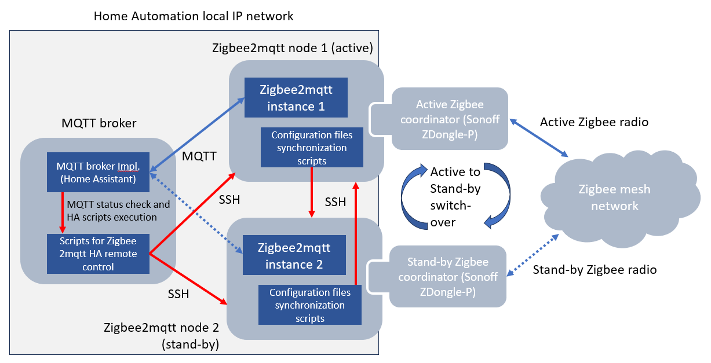

# Zigbee2mqtt High-Avaliability controller prototype

## Introduction

High Availability controller prototype for two zigbee2mqtt instances with independent USB zigbee dongles (specifically implemented for Sonoff ZBDongle-P). The final purpose is enabling that one of the zigbee2mqtt instances could play the "active" role, meanwhile the second one is in "stand-by" status for a single zigbee network (enabling also an automated switchover between active and stand-by nodes in case of detecting problems in the active instance). Please note that zigbee standard only allows to define a single coordinator node, so the only available high-availability model that could be used is active-stand by. Detailed features:

- __Automatic synchronization of zigbe2mqtt configuration and data files__ from active to stand-by instance, to ensure an up-to-date zigbee and mqtt interactions in case of active to stand-by switch over is triggered.
- __Automatic synchronization of Sonoff ZDongle-P coordinator's Non-Volatile RAM__, from active to stand-by instance, in each zigbee2mqtt node where the dongle is connected to. It enables a seamless change of zigbee coordinator from active to stand-by node when required (avoiding any impact on the rest of zigbee mesh nodes, not requiring to re-join them to the network).
- __Control point enabled in a third node__, where MQTT broker is working, to detect issues with active zigbmee2mqtt instance and trigger the switchover to change the service to use the stanby-by node. The prototype includes the automated management of this control point in a Home Assistant instance with MQTT component configured.

The overall design is shown in the following diagram:

</img>

## Environment details

Find below some relevant details about the prototype environment used. In case of using a diferent environment, it could be required to make some minor adaptations in the scripts provided:

- __Zigbee coordinators (2x)__: Sonoff ZBDongle-P. In case of using a different one, it could involve to change the commands to read and write non volatile memory in the dongles.
- __Zigbee2mqtt nodes (2x)__: usage of up-to-date Alpine Linux distribution to execute zigbee2mqtt service (https://www.zigbee2mqtt.io/). Zigbee2mqtt application is deployed and started and stopped using Alpine service commands defined for that purpose. In case of using a different distribution, some minor changes could be required for remote start and stop of zigbee2mqtt from controlling scripts.
  - Example of Alpine service content of /etc/init.d/zigbee2mqtt to start and stop the application with rc-service command: https://github.com/chemadh/zigbee2mqtt_ha/blob/main/zigbee2mqtt_alpine_service_example . __The zigbee2mqtt service should NOT be launched on node startup, otherwise the HA control prototype will not work properly__.
  - Alpine linux user is expected to allow sudo, to allow access to linux service scripts to start and stop zigbee2mqtt, as well as allowing zigpy-znp to access to dongle USB port.
- __MQTT broker node__: Usage of Linux Debian distribution for High-Availability control script execution. Home assistant containing the MQTT broker component communicating with Zigbee2mqtt deployed in Docker mode in the same Linux node. No impact expected by using a different Linux distribution or directly Home Assistant OS. Some referrence instructions:
  - Home Assistant supervised setup: https://community.home-assistant.io/t/installing-home-assistant-supervised-using-debian-12/200253
  - Installation of Mosquitto MQTT broker Home Assitant component:  https://www.home-assistant.io/integrations/mqtt

Common components used in the nodes previously defined:

- __Linux packages__: rsync, snmp (net-snmp-tools for Alpine; snmpd, snmp, libsnmp-dev, for Debian).
  - In addition to this, specifically for zigbee2mqtt nodes: python3, py3-pip. Instalation of zigpy-znp python component (pip install zigpy-znp). Aditional info in this link: https://github.com/zigpy/zigpy-znp/blob/0cacf7a51d205ac3a19acde10a8115cf5ac36ce1/TOOLS.md
- __NTPD or Timesyncd__ time sinchronization service to be active in each node to ensure a correct syncrhonization of most recent files. It can be skipped if the nodes are virtualized and obtaining time reference from a hypervisor cluster (like Proxmox Virtual Environment - https://pve.proxmox.com/wiki/Main_Page -). 
- __SNMP MIBs__: The scripts notify about execution results using SNMP traps. The MIBs to be incluided in each linux node using the proposed scripts are stored in https://github.com/chemadh/zigbee2mqtt_ha/tree/main/MIBs . In case of no monitoring system available in your installation, the scripts can be configured to not use SNMP, so these packages and MIB instalation could be skipped.
- __Enable remote ssh connection__ between components (MQTT broker and zigbee2mqtt nodes) without interactive credentials. Some example instructions here: https://www.thegeekdiary.com/how-to-run-scp-without-password-prompt-interruption-in-linux/

__Zigbee dongle configuration__:

- Zigbee IEEE address of active Zigbee coordinator (Sonoff ZBDongle-P) must be flashed as secondary IEEE address of the stand-by Zigbee coordinator. It is required to be identified as the same node by the rest of the zigbee network when the service is switched-over between coordinators. Please note that some of the flashing tools only shows the primary IEEE address, but it doesn't mean that the secondary address is not efectively updated. Some guides below to update firmware, read and write IEEE address in Sonoff ZBDongle-P:
  - https://sonoff.tech/wp-content/uploads/2021/12/SONOFF-Zigbee-3.0-USB-dongle-plus-firmware-flashing-1-1.pdf
  - https://www.zigbee2mqtt.io/guide/adapters/flashing/copy_ieeaddr.html
  - https://github.com/JelmerT/cc2538-bsl

## Scripts for synchronization of configuration files from active to stand-by zigbee2mqtt

Each zigbee2mqtt High-Availability instance needs to synchronize the configuration files from active to stand-by instances. The following scripts to be deployed in each zigbee2mqtt instance are shared to achieve it:

- [Script for sinchronization in zigbee2mqtt node 1 - /scripts/zigbee2mqtt1/syncZigbee2mqttConfig.sh](./scripts/zigbee2mqtt1/syncZigbee2mqttConfig.sh)
- [Script for sinchronization in zigbee2mqtt node 2 -/scripts/zigbee2mqtt2/syncZigbee2mqttConfig.sh](./scripts/zigbee2mqtt2/syncZigbee2mqttConfig.sh)

Both files include the same logic, with different example configuration parameters to define local or remote zigbee2mqtt node variables. The first lines in each script contains the configuration variables to be updated to each environment. Explanation of each parameter, below:

- __local_aux_dir__: Path of the local zigbee2mqtt instance auxiliary directory where the up-to-date active configuration files will be stored. Example value: /home/zigbee/scripts/zigbee2mqtt_config/
- __remote_conf_dir__: SSH path (including IP and username) to the remote zigbee2mqtt instance directory where the Zigbee2mqtt application reads and updates the configuration, when it is active. Example value: zigbee@192.168.34.124:/opt/zigbee2mqtt/data/
- __local_conf_dir__: Path of the local zigbee2mqtt instance directory where the Zigbee2mqtt application reads and updates the configuration, when it is active. Example value: /opt/zigbee2mqtt/data/
- __local_user_name__: Linux username to execute rsync command. It should be enabled to execute SSH over remote zigbee2mqtt node without requiring interactive credentials. Example value: zigbee
- __snmp_server__: SNMP server where the script will send SNMP traps (v2) notifying about the result of the execution. If this functionality is not required, the value of the variable should be leaved empty. Example value: 192.168.34.103:1234
- __snmp_host__: Source SNMP host of the trap, following the MIB defined for this purpose. It can be left empty if the SNMP functionality is not required. Example value: zigbee2mqtt1
- __local_zigbee2mqtt_frontend_ip__: Zigbee2mqtt normally uses a web frontend to enable application management. Since the web frontend IP is defined in the configuration files, it is required to be updated when synchronizing the configuration files between different nodes. This parameter defines de local zigbee2mtt instance web frontend IP. Example value: 192.168.34.123
- __remote_zigbee2mqtt_frontend_ip__: The same as the parameter above, but in this case, referring to the remote zigbee2mqtt instance web frontend IP. Example value: 192.168.34.124

The scripts are intended to be run with cron or timer services (i.e. each 5 minutes), to ensure an automatic zigbmee2mqtt configuration sinchronization. Example of this type of config in Alpine Linux with root user (more instructions in https://lucshelton.com/blog/cron-jobs-with-alpine-linux-and-docker/):

- include the following content in /etc/crontabs/root: */5     *       *       *       *       run-parts /etc/periodic/5min
- execute mkdir /etc/periodic/5min
- include the script content in /etc/periodic/5min/syncZigbee2mqttConfig
  - No .sh extension should be added to the servcie script.

## Scripts for Zigbee2mqtt High-Availability centralized control

A third node will control the active to stand-by failover action between zigbee2mqtt coordinators (whose configuration is synchronized using the scripts defined above). It makes sense that this third node should be the MQTT broker node (like Mosqitto runing in Home Assistant enviornment), since this element will be notified in case the communication with active zigbee2mqtt fails. The following set of scripts are provided for this purpose:

### [ping_mqtts.sh](./scripts/homeAssistant/ping_mqtts.sh)

Script to check connectivity from controller to both zigbee2mqtt intances. It is intended to check connectivity with both nodes before making an scheduled active to stand-by switchover. The first lines in the script contains the configuration variables to be updated for each environment. Explanation of each parameter, below:

- __zigbee2mqtt1_IP__: IP of first zigbee2mqtt instance. Example value: 192.168.34.123
- __zigbee2mqtt2_IP__: IP of second zigbee2mqtt instance. Example value: 192.168.34.124
- __snmp_server__: SNMP server where the script will send SNMP traps (v2) notifying about the result of the execution. If this functionality is not required, the value of the variable should be leaved empty. Example value: 192.168.34.103:1234
- __snmp_host__: Source SNMP host of the trap, following the MIB defined for this purpose. It can be left empty if the SNMP functionality is not required. Example value: homeassistant

The script can be directly executed from the linux prompt. No command-line parameters are required.

### [stopZigbee2mqtt1.sh](./scripts/homeAssistant/stopZigbee2mqtt1.sh) / [stopZigbee2mqtt2.sh](./scripts/homeAssistant/stopZigbee2mqtt2.sh) 

Couple of scritps to stop remotely each zigbee2mqtt instance. Used by the controller node to initiate a manual switchover between active and stand-by nodes, when MQTT can detect service interruption in the active zigbee2mqtt node. The first lines in the script contains the configuration variables to be updated for each environment. Explanation of each parameter, below:

- __zigbee2mqtt1_remote_ssh__ / __zigbee2mqtt2_remote_ssh__ (Depending on the script for each zigbee2mqtt instance): SSH user and IP to use for remote connection with the zigbee2mqtt node. The user should be previously configured to not require interactive login. Example value: "zigbee@192.168.34.123"
- __zigbee2mqtt_stop_cmd__: Remote stop command to execute in the remote SSH session to stop the zigbee2mqtt instance. In the case of using an Alipine Linux distribution for zigbee2mqtt (like in this prototype), the following can be used: "sudo rc-service zigbee2mqtt stop"
- __snmp_server__: SNMP server where the script will send SNMP traps (v2) notifying about the result of the execution. If this functionality is not required, the value of the variable should be leaved empty. Example value: 192.168.34.103:1234
- __snmp_host__: Source SNMP host of the trap, following the MIB defined for this purpose. It can be left empty if the SNMP functionality is not required. Example value: homeassistant

The script can be directly executed from the linux prompt. No command-line parameters are required.

### [activeZigbee2mqtt1.sh](./scripts/homeAssistant/activeZigbee2mqtt1.sh) / [activeZigbee2mqtt2.sh](./scripts/homeAssistant/activeZigbee2mqtt2.sh)

Couple of scripts to perform zigbee2mqtt switchover, changing the active service in the first or second node respectively. Sequence of activities followed by each script:

- __activeZigbee2mqtt1.sh__: it applies swicthover to active the service in zigbee2mqtt first node.
  - Stop zigbee2mqtt second node, that should be in active status.
  - Stop zigbee2mqtt first node, that should be in stand-by status (to ensure it is not previously active).
  - Extract zigbee USB dongle coordinator NVRAM memory content from zigbee2mqtt second node, copying it to zigbee2mqtt first node.
  - Load coordinator NVRAM memory content in zigbee2mqtt first node's dongle, load the synchronized zigbee2mqtt configuration files and start the first node instance.
  - Restart zigbee2mqtt second node, to leave it clean in case of scheduling a new switchover further. __Zigbee2mqtt should not start on system statup avoid interactions with this mechanism__.
- __activeZigbee2mqtt2.sh__: it applies swicthover to active the service in zigbee2mqtt second node.
  - Stop zigbee2mqtt first node, that should be in active status.
  - Stop zigbee2mqtt second node, that should be in stand-by status (to ensure it is not previously active).
  - Extract zigbee USB dongle coordinator NVRAM memory content from zigbee2mqtt first node, copying it to zigbee2mqtt second node.
  - Load coordinator NVRAM memory content in zigbee2mqtt second node's dongle, load the synchronized zigbee2mqtt configuration files and start the second node instance.
  - Restart zigbee2mqtt first node, to leave it clean in case of scheduling a new switchover further. __Zigbee2mqtt should not start on system statup avoid interactions with this mechanism__.

As described above, both scripts defines a similar logic, with different details to apply the switchover to a different node. The first lines in the script contains the configuration variables to be updated for each environment. Explanation of each parameter, below:
- __zigbee2mqtt1_remote_ssh__: SSH user and IP to use for remote connection with the first zigbee2mqtt node. The user should be previously configured to disable interactive login. Example value:"zigbee@192.168.34.123"
- __zigbee2mqtt2_remote_ssh__: SSH user and IP to use for remote connection with the second zigbee2mqtt node. The user should be previously configured to disable interactive login. Example value:"zigbee@192.168.34.124"
- __zigbee2mqtt_stop_cmd__: Remote stop command to execute in the remote SSH session to stop the zigbee2mqtt instance. In the case of using an Alipine Linux distribution like in this prototype, the following can be used: "sudo rc-service zigbee2mqtt stop"
- __zigbee2mqtt_start_cmd__: Remote start service command to execute in the remote SSH session to launch zigbee2mqtt instance. In the case of using an Alipine Linux distribution like in this prototype, the following can be used: "sudo rc-service zigbee2mqtt start"
- __snmp_server__: SNMP server where the script will send SNMP traps (v2) notifying about the result of the execution. If this functionality is not required, the value of the variable should be leaved empty. Example value: 192.168.34.103:1234
- __snmp_host__: Source SNMP host of the trap, following the MIB defined for this purpose. It can be left empty if the SNMP functionality is not required. Example value: homeassistant
- __coordinator_port_zigbee2mqtt1__: USB port where zigbee USB dongle is available in zigbee2mqtt first node. Example value: "/dev/ttyUSB0"
- __coordinator_port_zigbee2mqtt2__:  USB port where zigbee USB dongle is available in zigbee2mqtt second node. Example value: "/dev/ttyUSB0"
- __zigbee2mqtt_nvram_path__: Directory where the remote NVRAM dump file from USB coordinator dongle will be stored. Example value: "/home/zigbee/scripts/"
- __zigbee2mqtt_nvram_file__: Name of the remote NVRAM dump json file from USB coordinator dongle. Eample value: "backup_coordinator_nvram.json"
- __local_aux_dir__: Path of the remote zigbee2mqtt node directory where the up-to-date active configuration files are be stored. Example value: /home/zigbee/scripts/zigbee2mqtt_config/
- __local_conf_dir__: Path of the remote zigbee2mqtt node directory where the Zigbee2mqtt application reads and updates the configuration when it is active. Example value: /opt/zigbee2mqtt/data/

The scripts can be directly executed from the linux prompt. No command-line parameters are required.

## Usage of High-Availability control scripts from Home Assistant

## Possible further improvements

